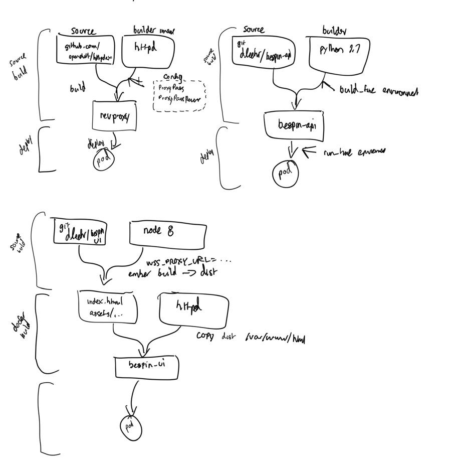

Bespin on Openshift
===================

This repo contains YAML files that can be used to run [bespin](https://github.com/Duke-GCB/bespin) services on [OpenShift](https://www.openshift.org).

See `deploy.sh` for deployment.

For contrast, our current approach, documented in [gcb-ansible-roles](https://github.com/Duke-GCB/gcb-ansible-roles), relies on Docker images built automatically on Docker Hub and running on dedicated VMs.

While OpenShift can run pre-built Docker images, this has not proven to work transparently with the images we've built, so some rethinking has been in order.

Two core differences caused a number of changes:

1. Processes inside containers do not run as root.
2. Some official Docker images (postgres, python) are not supported, usually due to (1) above

### Running without root

Attempting to run the Docker Hub-built bespin-api:apache image proved problematic, since the Apache service in this image assumes superuser privileges to bind to ports 80 and 443. It also assumed it could write to root-owned locations. After trying to change these on a branch, it seemed better to separate Django and Apache into two containers.

### Official Docker Images

In addition to the python:2.7 incompatibility, I found that the official postgres:9.5 image was not compatible either. Seems to also be a user-permission issue, but there are centos equivalent images for postgres, that use only slightly different environment variables for configuring postgres

### Advantages

Despite some frustration that an already-working Dockerized application required significant conversion to run on OpenShift, there are many advantages:

- Streamlined build/deploy from source (no more waiting for Docker Hub to build images or injecting WebSocket server hostnames into a travis build)
- User access control and event logging (who deployed what and when)
- Entire application stacks can be templated
- Easy to connect to GitHub or GitLab web hooks (provided cluster can be POSTed to)
- Laptop-side access to logs and interactive shells on any container (both CLI and web). Copy files in and out.
- Flexible and developer-focused multi-step builds
- Command-line tools can generate the YAML. While it's verbose, it's easy enough to adapt.

### Notes on bespin-web

Using gunicorn and whitenoise, I rewrote the bespin-api Django container to serve the API application and its static files on an unprivileged port. This fits better with the OpenShift architecture. It does not handle SSL termination or serve the UI assets.

I tried to write the Dockerfile here to build from python:2.7, and found that when OpenShift builds this image, it substitutes a centos python 2.7 base image, which would require an additional command to activate the [SCL](https://www.softwarecollections.org/en/) python version.

Instead of writing a Dockerfile, I decided to let OpenShift build a bespin-api docker image from the source code, using [S2I](https://github.com/openshift/source-to-image). As a standard django application, the only requirements for building under S2I were to create a `.s2i/environment` file, containing environment variables necessary at build time.

S2I builds from the Git source tree and produces a ready-to-run Docker image

For the UI assets, I wanted to build a container to serve the built Ember application with a simple web server like Apache. This is done with a two-step build. The first step uses S2I with a node-js image (and custom assemble script) to run the Ember build, providing the WSS URL at build time. The built Ember application is copied out and built into an Apache image by a Dockerfile build. The resulting image is apache-based and contains the production-built ember source.

To join the API and UI services behind a common URL, I wrote a simple apache config file to ProxyPass the various paths (`/`, `/api`,`/auth`, etc) to the approriate containers. This config file is installed in a `revproxy` apache container, and gives us a single endpoint for the external service.

This `revproxy` container is then exposed to the outside world with a route, which can be http or https.

### Container Network Diagram

### Build Diagram

